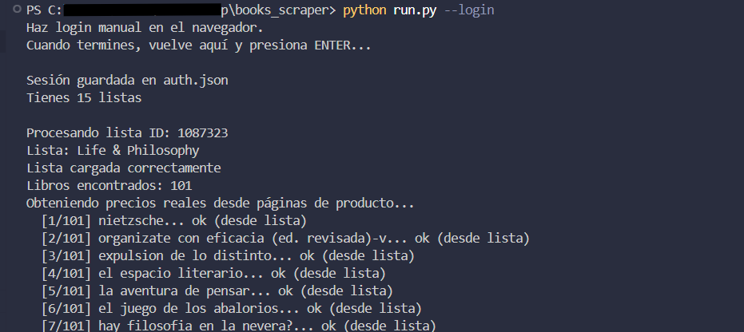
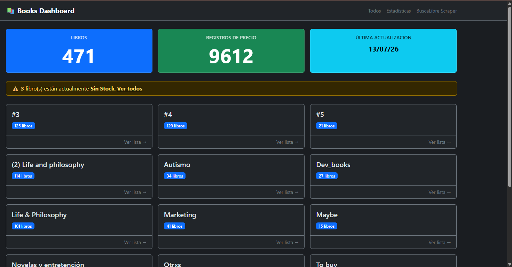
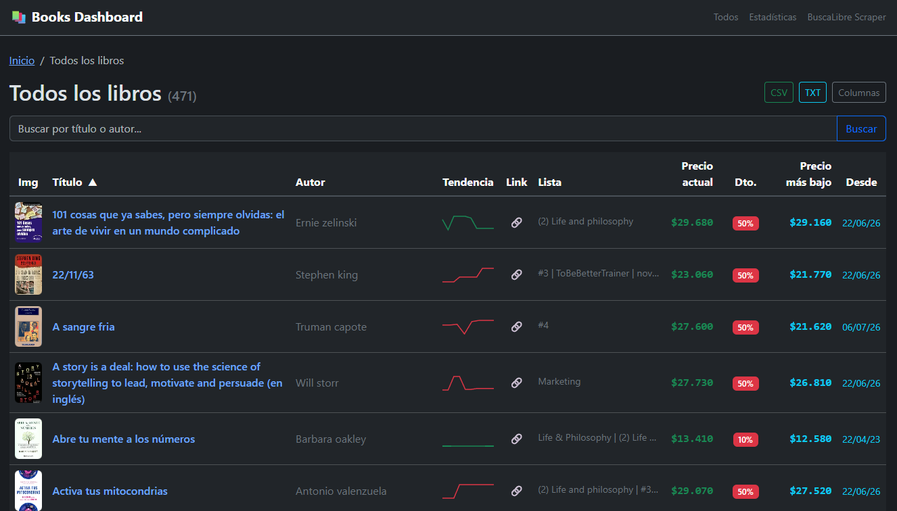
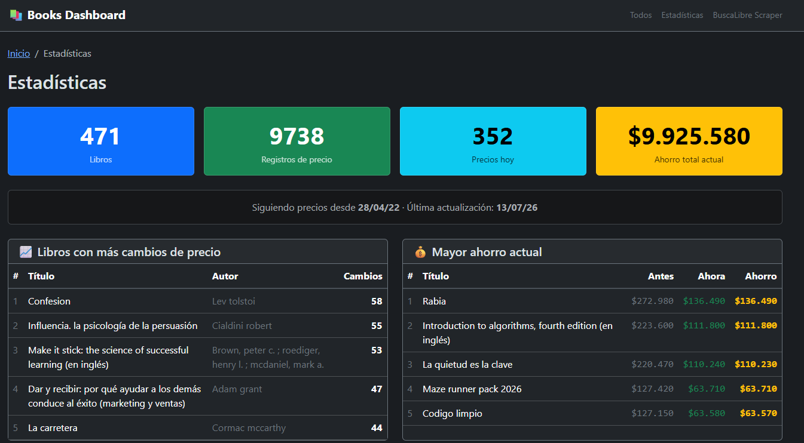
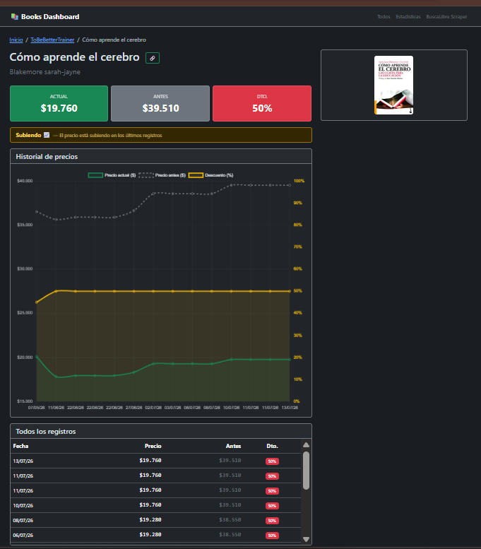
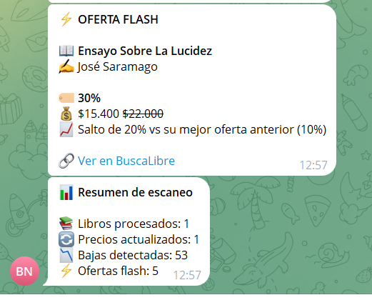

# Books Scraper — BuscaLibre.cl


Scraper de precios para listas de deseos de **BuscaLibre.cl** con historial, dashboard web y notificaciones por Telegram.

---

## Features

- **Scraping automático** — Obtiene precios de tus wishlists de BuscaLibre
- **Optimizado** — Usa precios visibles en la lista; solo visita páginas individuales cuando faltan datos
- **Historial de precios** — Cada precio queda registrado con fecha, descuento y estado (disponible / sin stock)
- **Notificaciones Telegram** — Alertas de bajas de precio > $5.000 y detección de ofertas flash
- **Dashboard web** — Flask + Chart.js + sparklines inline SVG
- **Múltiples listas** — Soporte para varias wishlists con organización N:M
- **Export CSV** — Descarga de datos completa
- **Recomendación de compra** — Algoritmo que sugiere el mejor momento según mínimo histórico y tendencia

---

## Demo

### Terminal — Ejecución del scraper



### Dashboard principal



### Todos los libros



### Estadísticas



### Detalle de libro con gráfico de precios



### Notificación por Telegram



---

## Stack

| Capa           | Tecnología                                  |
| -------------- | ------------------------------------------- |
| Scraping       | Python · Playwright (async) · BeautifulSoup |
| Backend        | Flask · SQLite                              |
| Frontend       | Bootstrap 5 · Chart.js · Sparklines SVG     |
| Notificaciones | Telegram Bot API                            |
| Automatización | Windows Task Scheduler / GitHub Actions     |

---

## Quick Start

```bash
# 1. Clonar
git clone https://github.com/maetenco/books-scraper.git
cd books-scraper

# 2. Dependencias
pip install -r requirements.txt
playwright install chromium

# 3. Configurar Telegram (opcional)
cp .env.example .env
# Editar .env con tu TOKEN y CHAT_ID de @BotFather

# 4. Login manual (primera vez)
python run.py --login

# 5. Ejecutar scraper
python run.py

# 6. Dashboard
python dashboard.py
# Abrir http://localhost:5000
```

---

## Estructura

```
books-scraper/
├── scrap.py          # Scraper principal (Playwright async)
├── telegram.py       # Notificaciones Telegram
├── dashboard.py      # Dashboard web Flask
├── run.py            # Entry point para ejecución
├── templates/        # Jinja2 templates
│   ├── layout.html
│   ├── index.html
│   ├── lista.html
│   ├── libro.html
│   ├── todos.html
│   └── stats.html
├── static/
│   ├── style.css
│   └── img/          # Screenshots del proyecto
├── tests/            # Tests con pytest
├── requirements.txt
├── LICENSE
├── .env.example
└── .gitignore
```

---

## Uso

| Comando                       | Descripción                                 |
| ----------------------------- | ------------------------------------------- |
| `python run.py`               | Scraping headless + notificaciones Telegram |
| `python run.py --no-telegram` | Solo scraping, sin notificar                |
| `python run.py --login`       | Modo manual (guarda sesión para headless)   |
| `python dashboard.py`         | Inicia el dashboard web en :5000            |
| `python scrap.py --headless`  | Solo scraping (sin run.py)                  |

---

## Arquitectura

```
BuscaLibre.cl
     │
     ▼ (Playwright)
  scrap.py
     │
     ▼ (SQLite)
  libros.db
     │
     ├──► telegram.py   →  Telegram API
     │
     └──► dashboard.py  →  Flask web :5000
               │
               ├── index.html   (resumen)
               ├── lista.html   (por wishlist)
               ├── todos.html   (búsqueda global)
                ├── libro.html   (detalle + gráfico)
                └── stats.html   (estadísticas)
```

---

## Arquitectura & Decisiones

### ¿Por qué Playwright y no Selenium?

Playwright tiene soporte **async nativo** con `asyncio`, lo que permite hacer scraping concurrently sin bloquear. Selenium requiere threads o multiprocessing para lograr algo similar. Además, Playwright incluye **auto-wait** (espera inteligente a que los elementos estén listos), manejo integrado de `storage_state` para persistir sesiones, y es más moderno en su API.

### ¿Por qué SQLite y no una base de datos relacional mayor?

El proyecto es **single-user**. No necesitas concurrencia, usuarios simultáneos ni un servidor de base de datos corriendo 24/7. SQLite es un archivo portable (`libros.db`), cero configuración, y suficiente para miles de registros de precios. Si en el futuro necesitas escalar, la migración a PostgreSQL es directa porque el código ya usa queries SQL estándar.

### Relación N:M entre wishlists y libros

La tabla `libros_listas` permite que **un libro pertenezca a múltiples wishlists** y que **una wishlist contenga muchos libros**. Esto modela la realidad de BuscaLibre, donde puedes tener un libro en "Favoritos" y en "Regalos" simultáneamente. Una relación 1:N habría forzado duplicación de datos.

### Historial append-only vs UPDATE

Cada escaneo crea una **fila nueva** en la tabla `precios` en vez de actualizar la existente. Esto construye un historial completo que alimenta:

- Los **sparklines SVG** inline en el dashboard (tendencia visual sin JavaScript).
- El **gráfico Chart.js** con eje dual (precio + descuento %).
- El **algoritmo de buy recommendation** que compara el precio actual con el mínimo histórico.

### Lazy scraping — optimización de requests

El scraper primero intenta leer el precio desde la **página de la wishlist** (donde BuscaLibre muestra `precioAhora` y `precioAntes`). Solo visita la **página individual del producto** si el precio no está visible o es `None` (línea 454 de `scrap.py`). Esto reduce significativamente la cantidad de requests y el tiempo de ejecución.

### Buy recommendation algorithm

El algoritmo en `dashboard.py:467-515` funciona así:

1. Compara el precio actual con el **mínimo histórico** de todos los registros.
2. Analiza la **tendencia** de los últimos 5 precios (bajada, subida o estable).
3. Si está a ≤3% del mínimo histórico → **"Mejor momento"**.
4. Si la tendencia es bajada → **"Espera"** (sigue bajando).
5. Si la tendencia es subida → **"Subiendo"** (comprar pronto o esperar corrección).
6. Sin tendencia clara → **"Sin tendencia clara"**.

### Schema migration sin framework

Las migraciones de esquema se hacen con `ALTER TABLE ... ADD COLUMN` envueltos en `try/except` (líneas 79-95 de `scrap.py`). Esto permite evolucionar la base de datos sin instalar un ORM o herramienta de migraciones, manteniendo el proyecto simple y sin dependencias extra.
